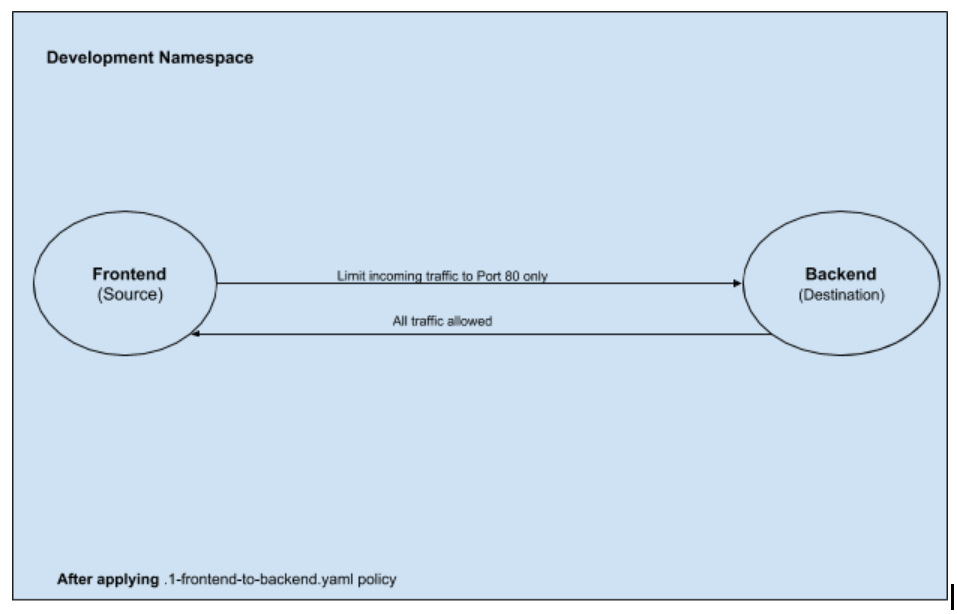
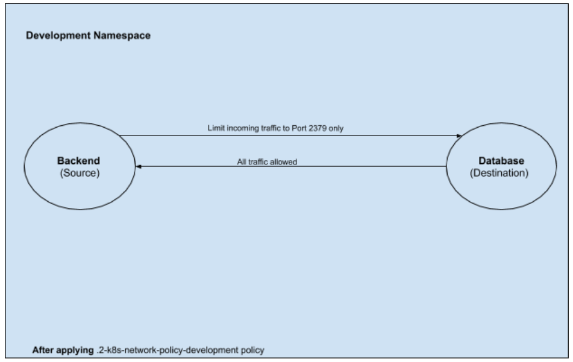
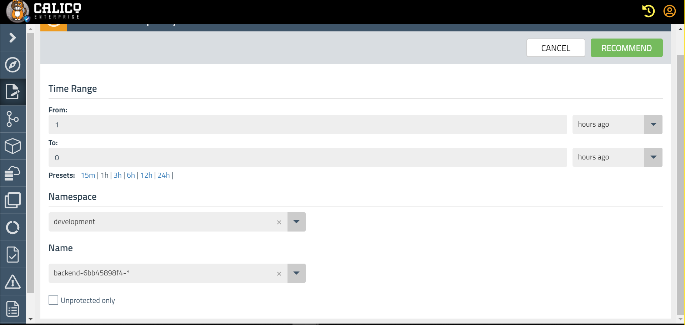
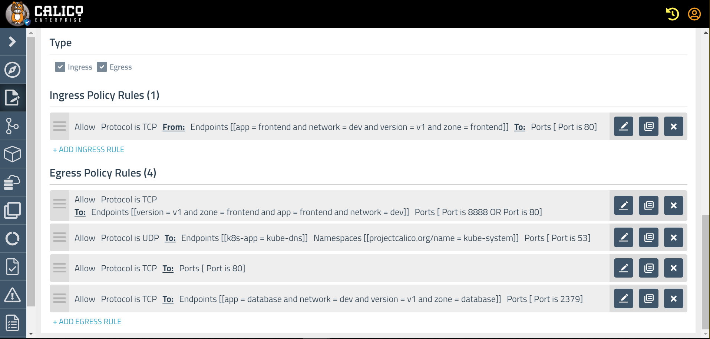

# Lab 1: Policy Workflow

## Lab 1.1 Hardening Application using Policies

Lab Tasks
1. As of now we have an open network where any entity in the cluster can talk to each other, this is an insecure scenario and is not recommended. Using the power of Calico's network and global network policy we can decide and restrict the flow of ingress and egress traffic that flows in or out of our cluster. But let us verify the connectivity before we apply any policy. For this lab we will be working in the `development` namespace

Let's start with checking the ip address information of our deployment.
```
kubectl get po -n development -o wide

NAME                        READY   STATUS    RESTARTS   AGE   IP
backend-6d56b49bcc-c4qt4    1/1     Running   0          85m   10.131.234.23
backend-6d56b49bcc-xpn6p    1/1     Running   0          85m   10.129.63.20
database-76776d56bc-mfmsg   1/1     Running   0          85m   10.129.63.19
frontend-656649f4bb-j5p4l   1/1     Running   0          85m   10.129.102.142

```

```
kubectl get svc -n development

NAME       TYPE        CLUSTER-IP       EXTERNAL-IP   PORT(S)        AGE
backend    ClusterIP   172.30.252.68    <none>        80/TCP         93m
database   ClusterIP   172.30.105.17    <none>        2379/TCP       93m
frontend   NodePort    172.30.232.216   <none>        80:30180/TCP   93m
```

Let us exec into the `Frontend` pod and try accessing the `Backend` pod and service. 
```
kubectl exec -ti -n development $(kubectl get pod -l app=frontend -n development -o name) -- bash
apt install iputils-ping -y
ping 10.131.234.23
curl -v telnet://10.131.234.23:80
ping backend
curl -v telnet://backend:80
exit
```
You should have the following behaviour:
* ping to the pod ip is successful
* curl to the pod ip is successful
* ping to backend fails
* curl to backend is successful

Services are  serviced  by kube-proxy which load-balances the service request to backing pods. The service is listening to TCP port 80 so the ping failure is expected.

We will be creating a `training-tier` where we will be placing all our Policies. Make sure you working directory is `1-policy-workflow`
```
cd 1-policy-workflow/
kubectl apply -f application-hardening-policies/development-policies/0-training-tier.yaml
```


Let's limit connectivity on the Backend pods to only allow inbound traffic to port 80 from the Frontend pod.

Below is the pictorial representation



```
To examine the policy
cat application-hardening-policies/development-policies/1-frontend-to-backend.yaml

Apply policy using
kubectl apply -f application-hardening-policies/development-policies/1-frontend-to-backend.yaml
```

Now, let's repeat the connectivity tests we did earlier.
You should have the following behaviour:

```
kubectl exec -ti -n development $(kubectl get pod -l app=frontend -n development -o name) -- bash
ping 10.131.234.23
curl -v telnet://10.131.234.23:80
ping backend
curl -v telnet://backend:80
exit
```


* ping to the pod now fails. This is expected since icmp was not allowed in the policy we have applied.
* curl to the pod ip is successful
* ping to backend fails
* curl to backend is successful

Let's cleanup the network policy for now.

```
kubectl delete -f application-hardening-policies/development-policies/1-frontend-to-backend.yaml
```

## Lab 1.2 Simulating and Mitigating an attack

First, let's start by simulating a pod compromise where the attacker is attempting to access the database from the compromised pod. We can simulate a compromise of the frontend pod by just exec'ing into the pod and attempting to access the database directly from there.

#### 1.2.1 Exec into frontend pod and access the Database

```
FRONTEND_POD=$(kubectl get pod -l app=frontend -n development -o jsonpath='{.items[0].metadata.name}')
kubectl exec -ti $FRONTEND_POD -n development  -c frontend -- bash
```

From within the frontend pod, attempt to access the database directly. The attack will succeed, and the balance of all users will be returned. This is expected as there are no policies limiting access yet.

```
curl http://database:2379/v2/keys?recursive=true | python -m json.tool
exit
```

#### 1.2.2. Create Kubernetes Network Policy limiting access

We can use a Kubernetes Network Policy to protect the Database.

Representation of the policy is as belows




```
To examine the policy
cat application-hardening-policies/development-policies/2-k8s-network-policy-development.yaml

Apply policy using
kubectl apply -f application-hardening-policies/development-policies/2-k8s-network-policy-development.yaml
```

#### 1.2.3 Retrying the attack

This time the direct database access should fail from the fronted pod. Exec into the pod and trigger the curl request below.

```
kubectl exec -ti $FRONTEND_POD -n development  -c frontend -- bash
```

```
curl http://database:2379/v2/keys?recursive=true | python -m json.tool
exit
```
The curl will be blocked and return no data.  You may need to CTRL-C to terminate the command.  Then remember to exit the pod exec and return to the host terminal.
```
exit
```

```
kubectl delete -f application-hardening-policies/development-policies/2-k8s-network-policy-development.yaml
```

## Lab 1.3 : Policy Recommendation using Calico Enterprise
Objective: Users without any experience of creating Calico Enterprise network policy, can simply specify a few parameters, click a button, and generate a valid Calico Enterprise network policy to protect their workloads.

Lab tasks

1. Generate egress traffic on backend pod for few minutes using the script traffic_generation.sh
```
./traffic_generation.sh >> /dev/null &
```


2. Navigate to Policy section on Calico Enterprize web-console and click on Recommend Policy button
- Provide 5 mins in From Time Range and 0 in To Time Range.
- Select "development" namespace.
- Select backend* pod name.
- Click on Recommend policy button.


3. On the Policy page - check the policy rules which allows Egress traffic to port 80 and to port 53 (kube-dns).


4. To check how the policy looks we can click on Preview button, `Stage` option demonstrates what traffic will be allowed and what will be denied without actually Enforcing the policy, `Enforce` option actually applies the policies with recommended rules.


5. Now to check the policy behavior we can click on stage button, start generating the traffic and in few seconds it will show the traffic inflow/outflow on Staged policy UI.







