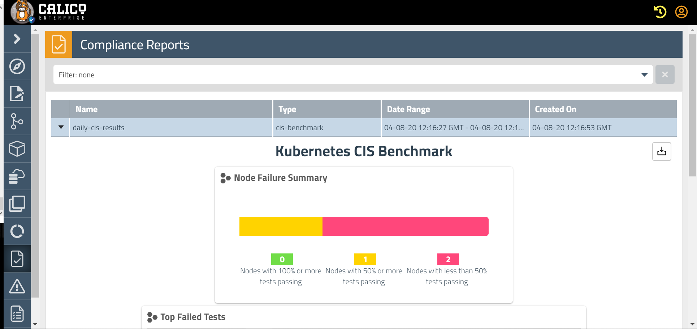

# Lab 3.0 : Auditing and Compliance reporting - CIS Benchmark Reports

Lab objective : To assess your Kubernetes clusters against CIS benchmarks is a standard requirement for your organization’s security and compliance posture.

Calico Enterprise CIS benchmark compliance reports provide this view into your Kubernetes clusters. Plus, the reports strengthen your threat detection capability, providing a more comprehensive view than looking only at network data


Lab tasks

1. Configure compliance-reporter-pod manifest.

```
./configure-cr.sh
```
The above script is responsible to update the compliance-reporter-pod.yaml manifest with appropriate reporter-token secret name, report name and report start time in UTC 3339 format


2. In the following example, we use a GlobalReport with CIS benchmark fields to schedule and filter results. The report is scheduled to run at midnight of the next day (in UTC), and the benchmark items 1.1.4 and 1.2.5 will be omitted from the results.

```
kubectl apply -f cis-globalreport.yaml
```


3. Apply the compliance-reporter-pod.yaml manifest to manually run the reports. Make sure the below manifest is configured with appropriate reporter-token secret name, report name and report start time in UTC 3339 format

```
kubectl apply -f compliance-reporter-pod.yaml
```
The output on the Tigera Manager should look as follows:



