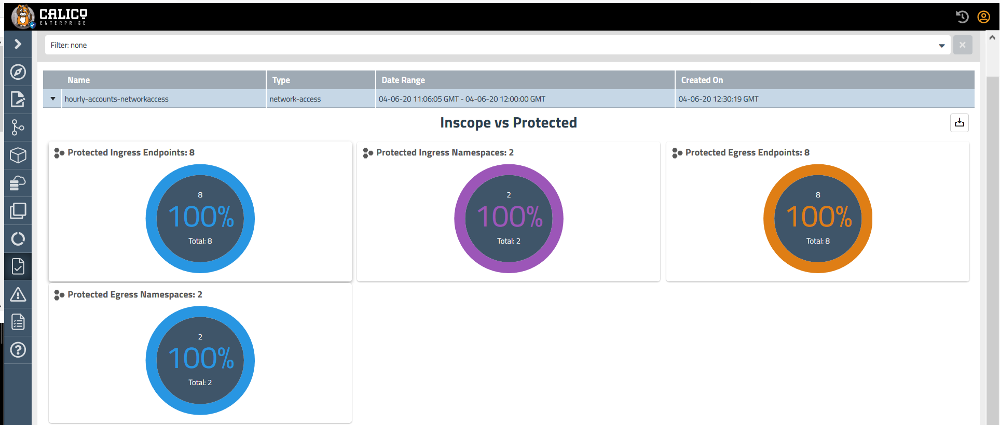

# Lab 3.1: Compliance reporting

This lab will not work on Openshift Cluster as Openshift 4.x does not support Audit logging.

Lab objective : Assess Kubernetes workloads and environments for regulatory compliance to enforce controls, and generate audit and evidence data – so you can prove compliance for these highly dynamic and ephemeral workloads.


Lab tasks

1. Configure Kubernetes Audit logs and compliance-reporter-pod.yaml manifest

```
./configure-kubeapiserver.sh
./configure-cr.sh
```
The above script configures audit logs for additional Kubernetes resources like pod, namespace, serviceaccount, networkpolicy by making necessary changes to kube-apiserver.yaml. It is also responsible to update the compliance-reporter-pod.yaml manifest with appropriate reporter-token secret name, report name and report start time in UTC 3339 format

2. Apply the below manifest that creates Hourly reports, endpoints in named namespaces [development, staging, production]

```
kubectl apply -f hourly-zone-globalreport.yaml
```


3. Apply the compliance-reporter-pod.yaml manifest

```
kubectl apply -f compliance-reporter-pod.yaml
```

The output on the Tigera Manager should look as follows:



