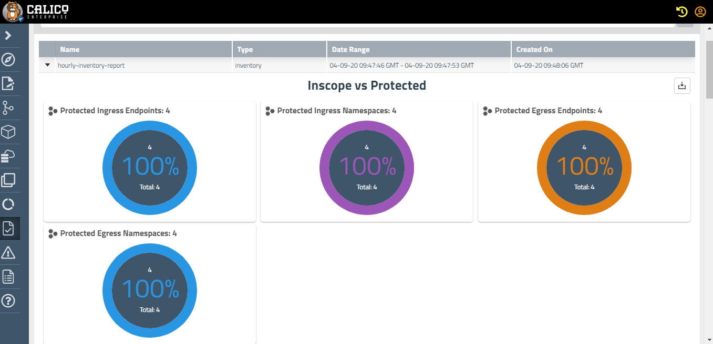

# Lab 3.2: Auditing and Compliance reporting - Inventory Report

Lab objective : Generating Inventory reports for endpoints with label "app=frontend"

Lab tasks

1. Configure compliance-reporter-pod manifest.

```
./configure-cr.sh
```
The above script is responsible to update the compliance-reporter-pod.yaml manifest with appropriate reporter-token secret name, report name and report start time in UTC 3339 format


2. In the following example, creates a GlobalReport that results in a daily inventory report for endpoints in the development, staging, production namespace.

```
kubectl apply -f hourly-inventory-globalreport.yaml
```


3. Apply the compliance-reporter-pod.yaml manifest to manually run the reports. Make sure the below manifest is configured with appropriate reporter-token secret name, report name and report start time in UTC 3339 format

```
kubectl apply -f compliance-reporter-pod.yaml
```
The output on the Tigera Manager should look as follows:



